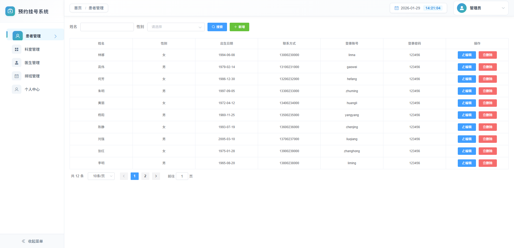
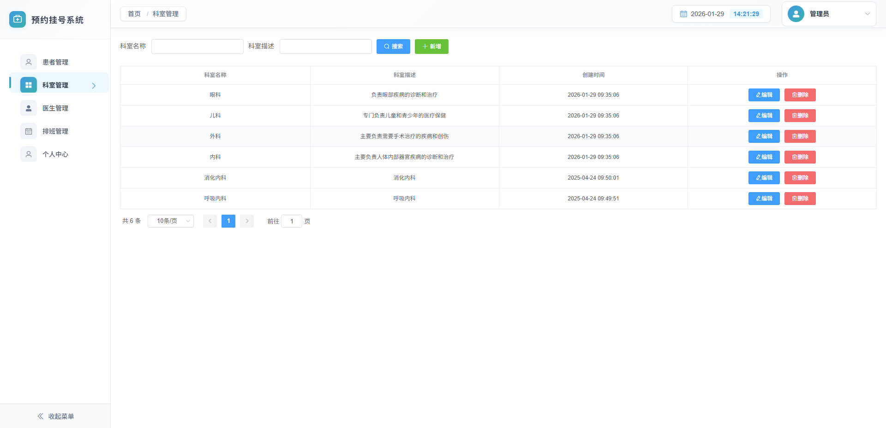
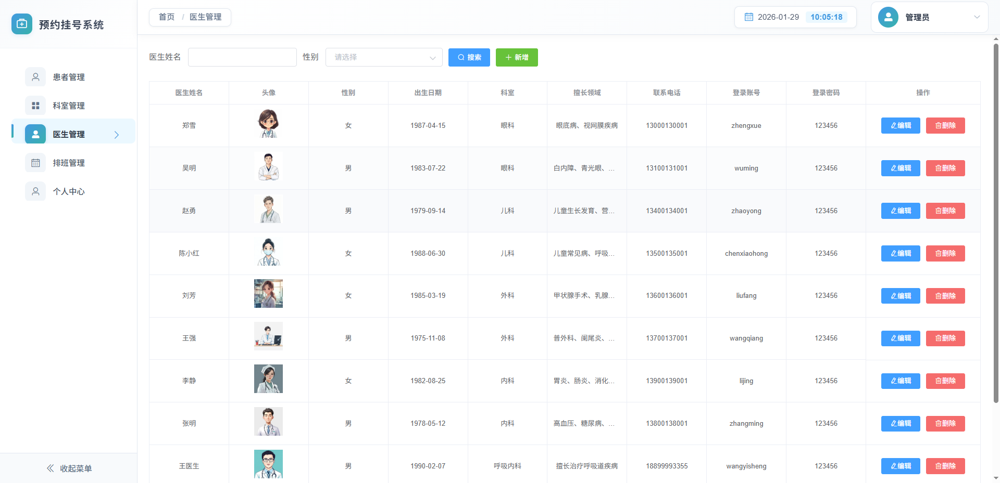
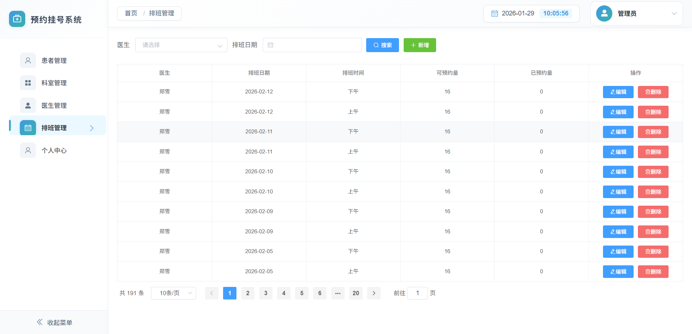
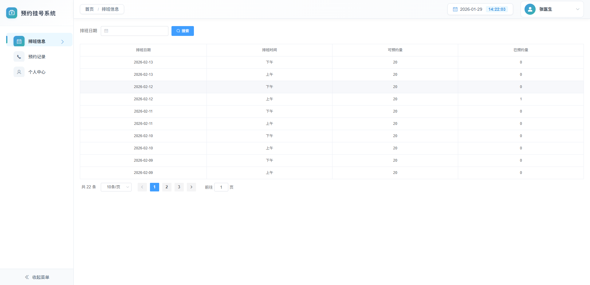
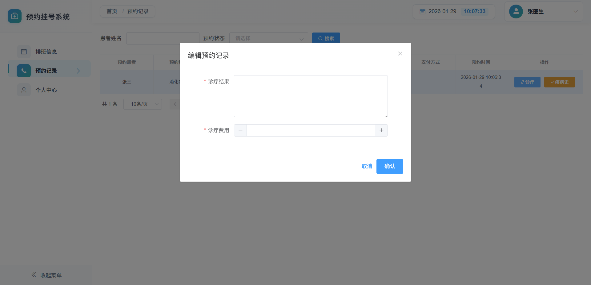
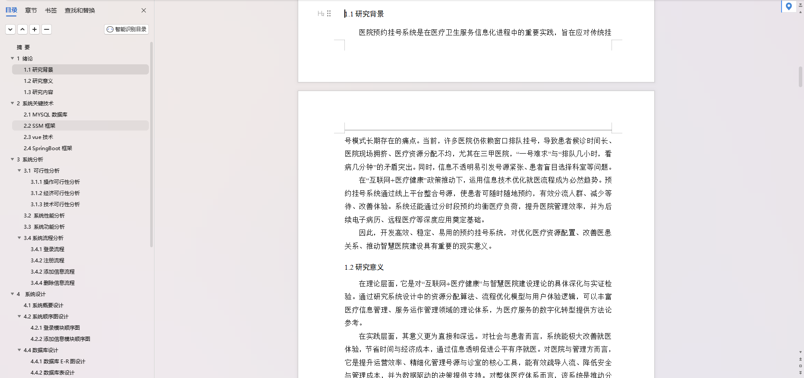
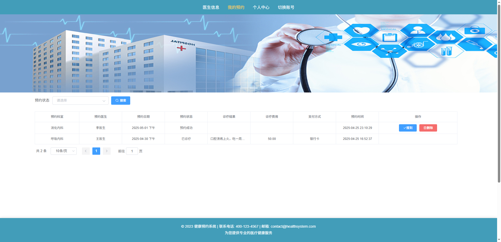
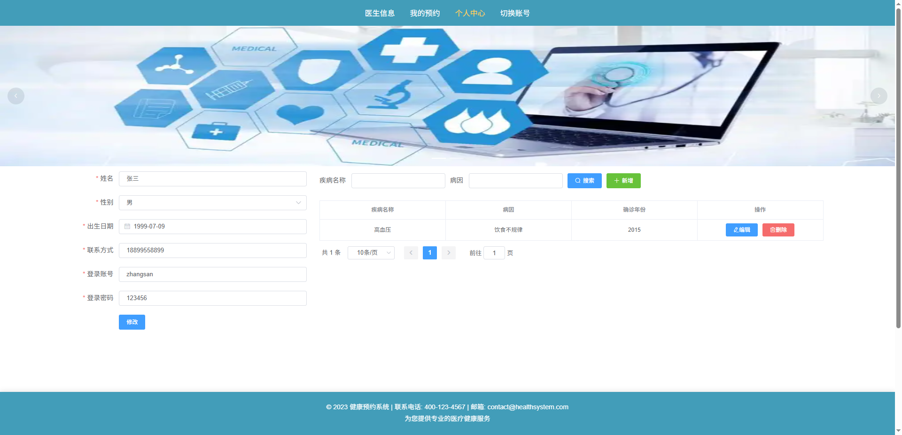
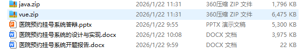

# 项目介绍
SpringBoot+Vue医院预约挂号系统
包含前后端代码、开TI报告模板、答辩ppt、设计文档
- 咨询V：bishe688
# 功能介绍：

## 登录注册
系统用户分为三类，管理员、医生和患者。医生通过管理员添加到系统。患者可以注册到系统，也可以由管理员添加到系统。

## 管理端功能：
- 患者管理：管理用户基本信息。
  
- 科室管理：管理科室信息，包括科室名称、科室介绍
  
- 医生管理：管理医生基本信息。
  
- 医生排班管理：管理医生排班信息，包括排班日期、排班时间、可预约量。
  

## 医生端功能：
- 查看排班信息：医生可以查看自己的排班信息
  
- 挂号信息：查看自己的预约记录，进行就诊。用户报道后可以录入诊疗结果和诊疗费用。医生可以查看用户的疾病史。
  
- 个人中心：查看和修改个人信息。
  

## 患者端功能：
- 查看医生信息：用户可以查看医生信息，点击查看详情。
  
- 预约挂号：查看医生详情，选择日期进行挂号。
  
- 我的预约：用户可以查看自己的预约记录，包括预约日期、预约时间，预约后可以进行报道。医生录入诊疗结果后用户可以进行支付。
  
- 个人中心：用户可以查看和修改个人信息，管理疾病史,包括疾病名称、病因、确诊年份。
  

# 万字文档

# 文档清单

# 需要源码文档请联系
V：bishe688

